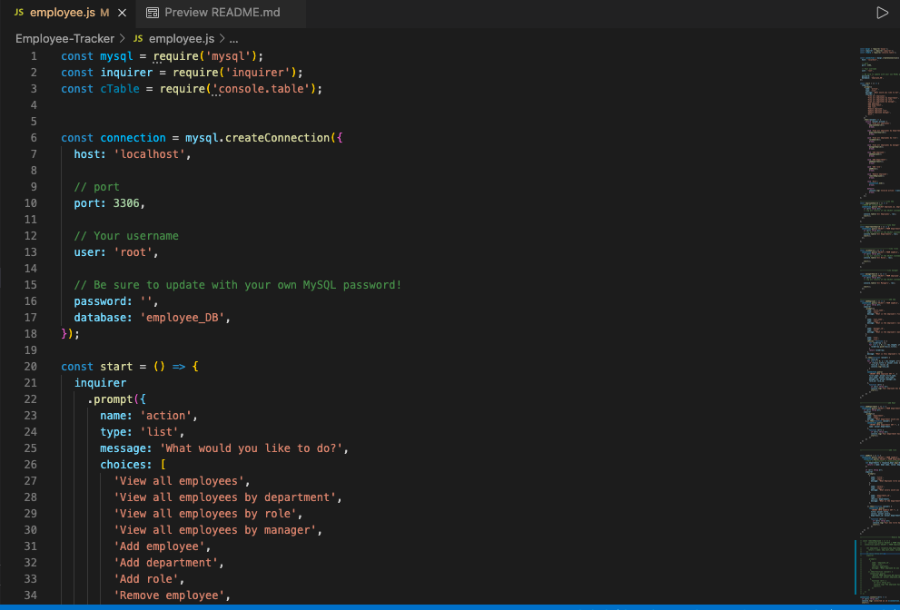
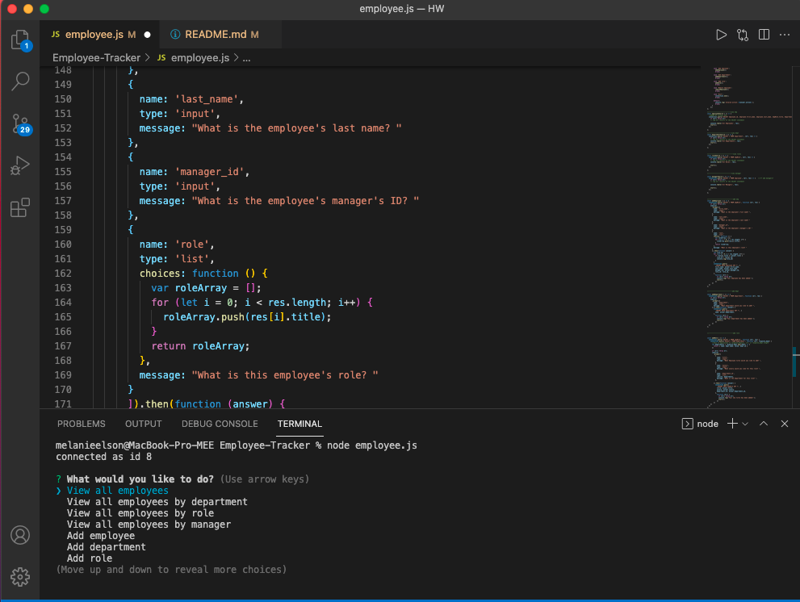

# Employee-Tracker

## Table of Contents
1. [Title](#title)
2. [Description](#Description)
3. [Installation](#Installation)
4. [Technologies](#Technologies)
5. [Collaboration](#Collaboration)
6. [Steps](#Steps)
7. [Walkthrough](#Walkthrough)

# Description
* Developers are often tasked with creating interfaces that make it easy for non-developers to view and interact with information stored in databases. Often these interfaces are known as **C**ontent **M**anagement **S**ystems. In this homework assignment, your challenge is to architect and build a solution for managing a company's employees using node, inquirer, and MySQL.

# Installation
* To install: node employee.js
## Links
* https://github.com/MelElson/Employee-Tracker
* https://drive.google.com/file/d/1jfYS16miuVaaAOYooWiQilcVxPDgfu12/view 

# Technologies 
The site uses Javascript, Node,js, Inquirer, Express, MYSQL

# Collaboration 
Pulls are encouraged. Any changes document. 

# Steps
* The command-line application should allow users to:

  * Add departments, roles, employees

  * View departments, roles, employees

  * Update employee roles

# Walkthrough
### Employee Tracker Screenshot

### Employee Tracker Input

### Walkthrough

